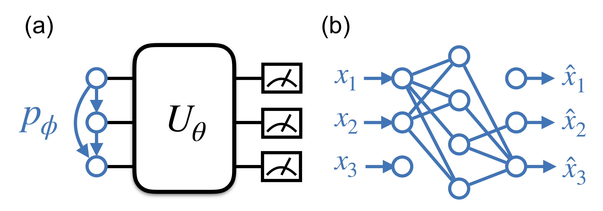

<div align="center">

</div>

## Solving Quantum Statistical Mechanics with Variational Autoregressive Networks and Quantum Circuits 

[](https://travis-ci.com/wangleiphy/BetaVQE.jl)

### Setup
Clone this repo, add dependancies by typing `]` in a Julia REPL, and then
```julia
pkg> add Yao YaoExtensions
pkg> add StatsBase Zygote Flux JLD2 FileIO Fire
pkg> dev https://github.com/wangleiphy/VAN.jl.git 
pkg> dev .
```

To make sure it works, type
```bash
julia test/runtests.jl
```
in a terminal to run tests.

### Run

Run this to train the transverse field Ising model
```bash 
julia runner.jl learn 2 2 2.0 2.0
```

This utility accepts the following arguments

* nx::Int=2, lattice size in x direction,
* ny::Int=2, lattice size in y direction,
* Γ::Real=1.0, the strength of transverse field,
* β::Real=1.0, inverse temperature,

and keyword arguments

* depth::Int=5, circuit depth,
* nsamples::Int=1000, the batch size used in training,
* nhiddens::Vector{Int}=[500], dimension of the VAN's hidden layer,
* lr::Real=0.01, the learning rate of the ADAM optimizer,
* niter::Int=500, number of iteration,
* cont::Bool=false, continue from checkpoint if true.

### Paper
[arXiv:1912.11381](https://arxiv.org/abs/1912.11381)

